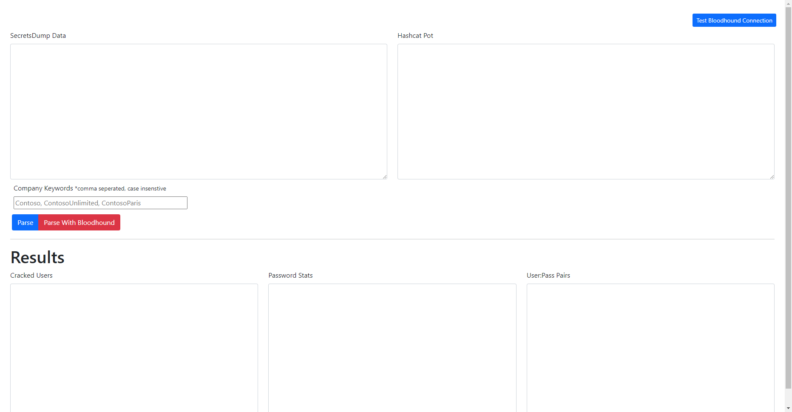

# CatHound
A serverless hashcat parsing tool. Simplely run open the HTML file in your browser.



## Setup
- Ensure the neo4j service is running and reachable from your host
- Edit lines 16,17,18 with your Neo4j Username, Password, and URL
- Refresh the page and click the `Test Bloodhound Connection` in the top right corner of the page

---

# Input


#### SecretsDump Data Format
*Accepts Users and Machine Accounts
```
contoso.int\Administrator:500:aad3b435b51404eeaad3b435b51404ee:44cf6450316d2576cf5680e33ddcd940:::
Guest:501:999d3225ccce619eaad3b435b51404ee:afe58069dad3c0d3fa42149193568d64:::
krbtgt:502:aad3b435b51404eeaad3b435b51404ee:67205ff533535d6146b78e26ad7bc659:::
DefaultAccount:503:aad3b435b51404eeaad3b435b51404ee:31d6cfe0d16ae931b73c59d7e0c089c0:::
```

#### Hashcat Pot Format
```
44cf6450316d2576cf5680e33ddcd940:sladmin
c9383e64986894022d4dbf77ab6aa111:Password2019
72a786126c66be37ff4b63f987e6bf13:P@assword12
e19ccf75ee54e06b06a5907af13cef42:P@ssw0rd
5b349445fd8ade9f7d8215dca92464aa:Passw0rd12!
9307ee5abf7791f3424d9d5148b20177:Welcome1!
```

#### Company Keywords
A comma seperated list of keywords used to indicate the company name. Optional.

---

# Parsing Modes
## Parse (Without Bloodhound)
Parsing will match Secrets Dump entries with the cracked hashes from the hashcat pot. 

**Password Stats Output:**
```
Total Users:
Total Cracked Users:
Total Unique User Passwords:

Users with "password" variation in their password:
Users with "welcome" variation in their password:
Users with season variation in their password:
Users with month variation in their password:
Users with company name in their passwords:
Users with passwords that are shared with other accounts:
```


## Parse with Bloodhound
Parsing with Bloodhound add the following functionalilty:
- Users that have their password cracked will be marked as owned in bloodhound
- Users that have their password cracked will have the property `password` added to bloodhound. This new property can be viewed in the GUI.
- Users in the Enterprise Admins, Domain Admins, Built-in Administrators and Account Operators Groups, will be returned to CatHound for to added to the stats coloumn.

**Password Stats Output:**
```
Total Users:
Total Cracked Users:
Total Unique User Passwords:

Members of the Domain Admins Group who's passwords were cracked:
Members of the Enterprise Admins Group who's passwords were cracked:
Members of the Built-in Administrators Group who's passwords were cracked:
Members of the Account Operators Group who's passwords were cracked:
Users with "password" variation in their password:
Users with "welcome" variation in their password:
Users with season variation in their password:
Users with month variation in their password:
Users with company name in their passwords:
Users with passwords that are shared with other accounts:
```


---
# Output


## Cracked Users
Cracked users will display the SamAccountNames of users who had their password cracked sorted by alphanumeric. This list is typically given to the client as the master cracked user list.
```
contoso.int\Administrator
```

## Password Stats
Addition password stats in the domain. See Password stats output for each mode.

## User:Pass Pairs
Cracked Username and Password pairs in the format of `Username:Password` will appear here. Typically, this is kept for internal use only.
```
contoso.int\Administrator:sladmin
```
---
# Misc
### Pattern Matching
Password patterns is done by replace leet characters with regular ones, and making the string lowercase.

**Example:**
`P@55W0RD1` is turned into `passwordi`. CatHound will then attempt to find the word `password` with in this string. 

### Change Log
0.1.1
- Added Count to each stat
- Fix issue with Custom word list where null entires were counted

### TODO
- [ ] Regex parsing to ensure proper input
- [ ] CSS
- [ ] Add Section for cracked machine accounts.
- [ ] Get User names from bloodhound for better name output (Administrator, Guest, krbtgt don't have domains from the secretsdump file)